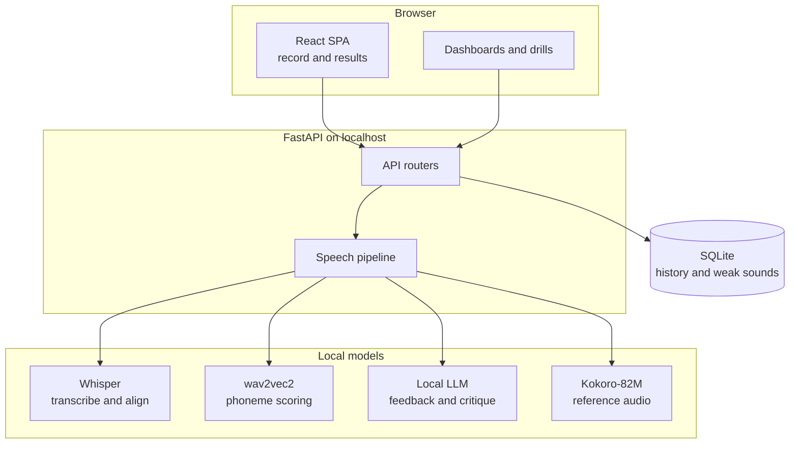
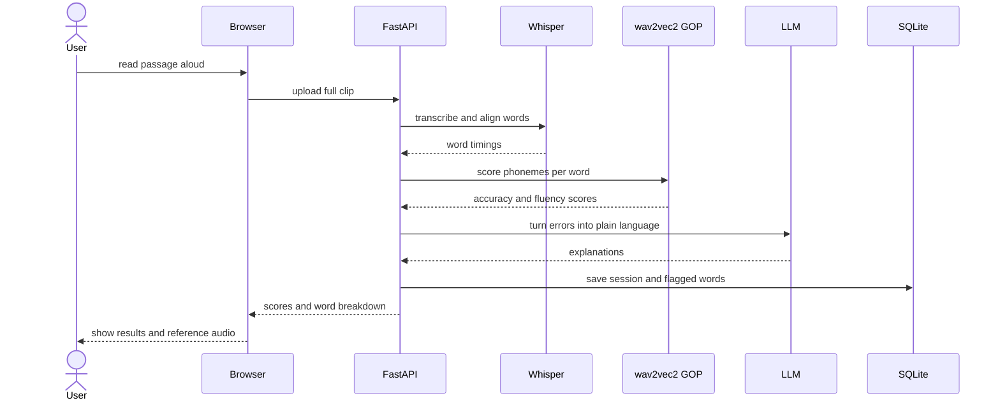
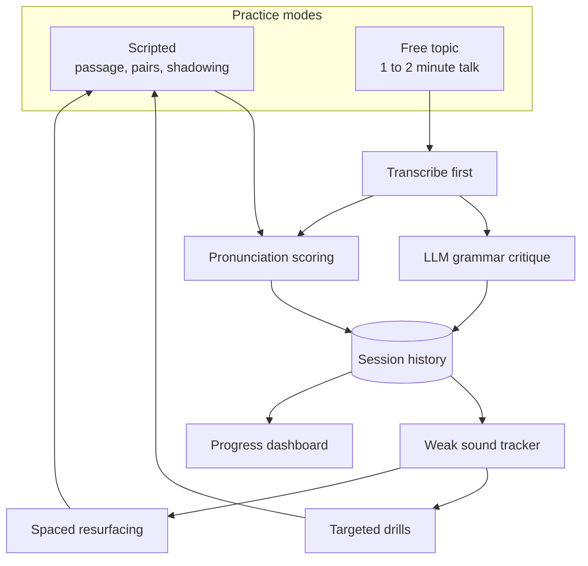
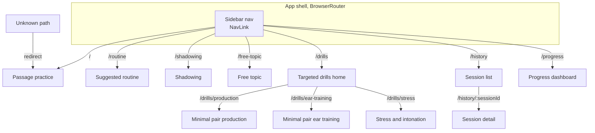

# Diagrams

Four views of Diction, driven by `.claude/ARCHITECTURE.md` and `.claude/REQUIREMENTS.md`. The first shows what the system is built from, the second follows a single practice session as it gets scored, the third shows how saved sessions feed the ongoing training loop that the features hang off, and the fourth maps the browser routes to the surfaces they render.

## What the system is made of

The layered structure, from the browser down to local storage. Nothing leaves the machine.

The browser owns mic capture and display. FastAPI owns the model pipeline and storage. The four models run on the same GPU, called one at a time under the record-then-analyze pattern, so no concurrency or streaming logic is needed. Storage is a single SQLite file, shared by every practice mode.

## How one practice session gets scored

The record-then-analyze lifecycle for a scripted passage. The clip is captured in full, then processed in stages.

Whisper runs first because word-level timings tell the GOP scorer where each word sits in the audio. The LLM step is presentation, not measurement: it rewrites raw phoneme errors into readable feedback, batched once per session over Ollama. Because every stage is sequential and tolerates multi-second latency, the whole path stays simple to reason about. The scoring flow is v0.1, with the LLM explanation step landing in v0.2 alongside reference audio.

## How sessions turn into ongoing practice

The two input paths and the loop they feed. This is the mental model for the feature set: a session is not an endpoint, it is fuel for the next one.

Two paths enter. Scripted modes compare against a known reference, so they go straight to scoring. Free-topic talk has no reference text, so it transcribes first, then splits into an independent grammar critique and the same pronunciation scoring. Both converge on one session history.

From there the loop closes. The weak-sound tracker aggregates recurring errors across sessions, which drives both the targeted drills and the spaced resurfacing that feeds old misses back into new scripted practice. The dashboard reads the same history for trends. The roadmap builds this loop outward: v0.3 adds the tracker and dashboard, v0.4 the drills, v0.6 the resurfacing, and v0.7 wires in the free-topic path last.

## How the browser routes between surfaces

The `react-router-dom` route map for the SPA shell. Each route renders one surface, and the URL is the single source of truth for which surface shows.

The shell keeps URL state only, while TanStack Query owns every fetch. A refresh or a shared link resolves straight to the surface, so a session detail is deep-linkable and the browser back button walks the route history. The sidebar groups the practice surfaces, passage, routine, shadowing, free topic, and the drill home, alongside history and progress. The drill home branches to the production, ear-training, and stress-and-intonation drills. An unknown path redirects to passage practice so a mistyped route lands on the primary surface rather than a blank one.
