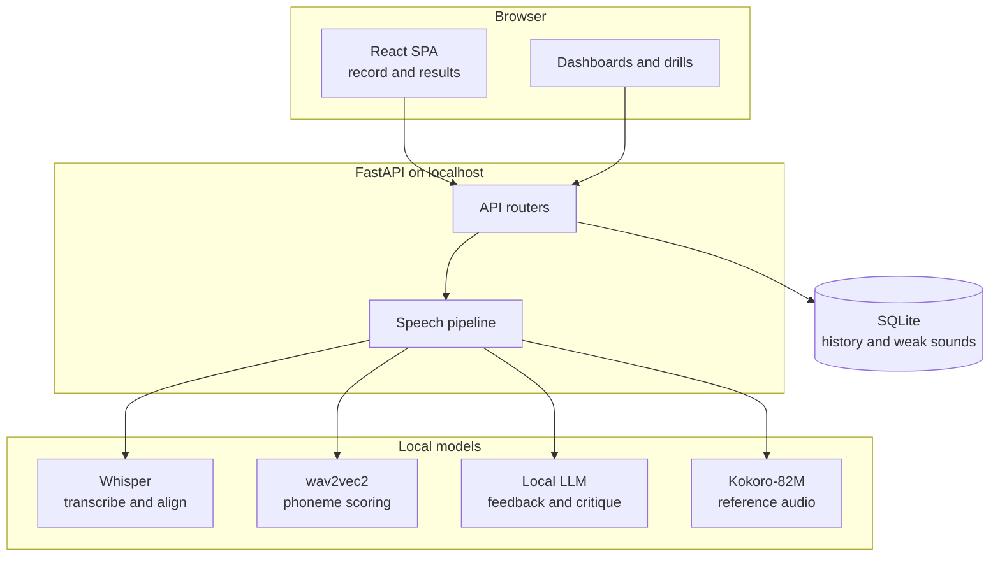
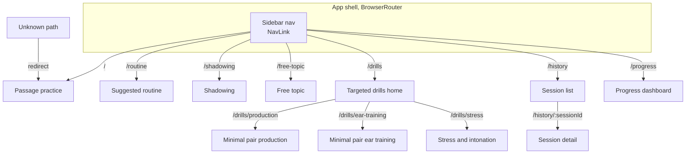

# Components

The layered structure, from the browser down to local storage. Nothing leaves the machine.

The browser owns mic capture and display. FastAPI owns the model pipeline and storage. The four models run on the same GPU, called one at a time under the record-then-analyze pattern, so no concurrency or streaming logic is needed. Storage is a single SQLite file, shared by every practice mode.

## How the browser routes between surfaces

The `react-router-dom` route map for the SPA shell. Each route renders one surface, and the URL is the single source of truth for which surface shows.

The shell keeps URL state only, while TanStack Query owns every fetch. A refresh or a shared link resolves straight to the surface, so a session detail is deep-linkable and the browser back button walks the route history. The sidebar groups the practice surfaces, passage, routine, shadowing, free topic, and the drill home, alongside history and progress. The drill home branches to the production, ear-training, and stress-and-intonation drills. An unknown path redirects to passage practice so a mistyped route lands on the primary surface rather than a blank one.
