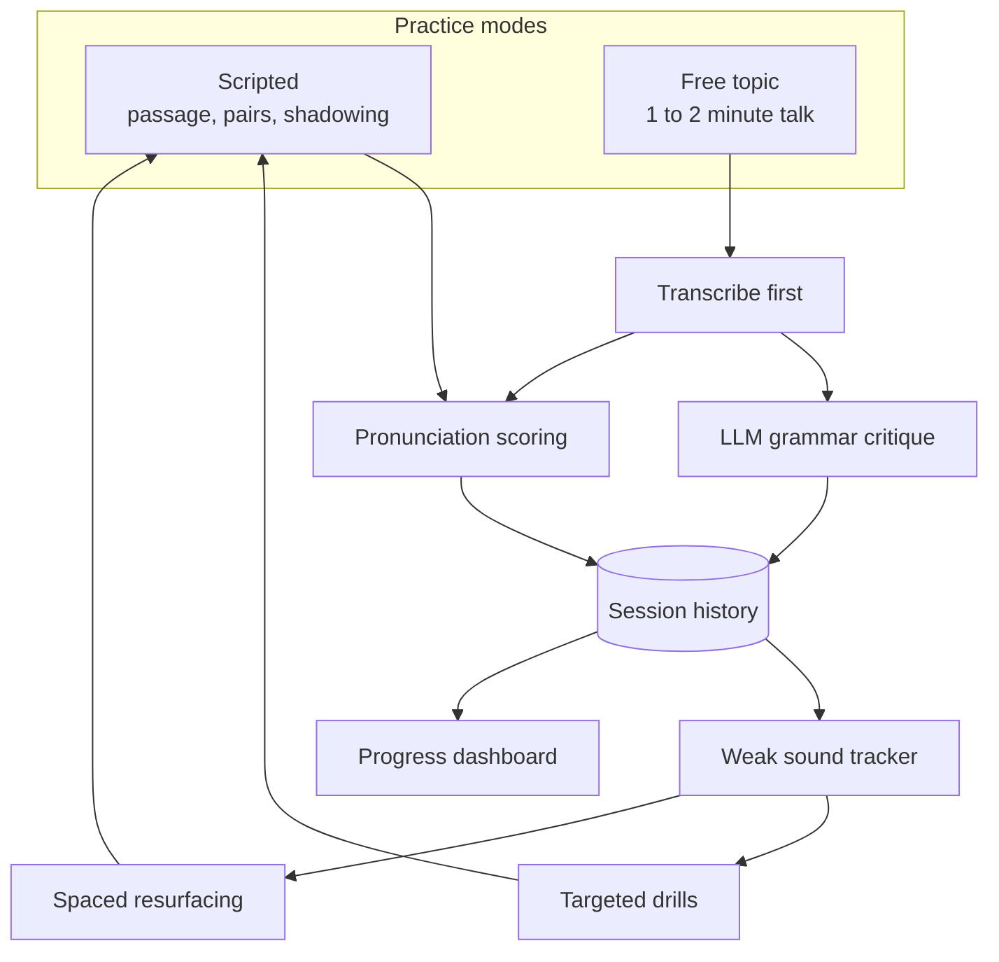

# Data pipeline

The two input paths and the loop they feed. This is the mental model for the feature set: a session is not an endpoint, it is fuel for the next one.

Two paths enter. Scripted modes compare against a known reference, so they go straight to scoring. Free-topic talk has no reference text, so it transcribes first, then splits into an independent grammar critique and the same pronunciation scoring. Both converge on one session history.

From there the loop closes. The weak-sound tracker aggregates recurring errors across sessions, which drives both the targeted drills and the spaced resurfacing that feeds old misses back into new scripted practice. The dashboard reads the same history for trends. This loop was built outward version by version: v0.3 added the tracker and dashboard, v0.4 the drills, v0.6 the resurfacing, and v0.7 wired in the free-topic path last.
