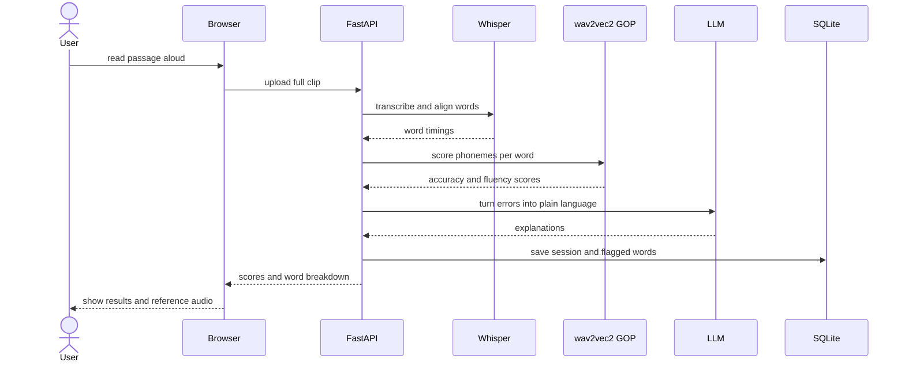

# Request flow

The record-then-analyze lifecycle for a scripted passage. The clip is captured in full, then processed in stages.

Whisper runs first because word-level timings tell the GOP scorer where each word sits in the audio. The LLM step is presentation, not measurement: it rewrites raw phoneme errors into readable feedback, batched once per session over Ollama. Because every stage is sequential and tolerates multi-second latency, the whole path stays simple to reason about. The scoring flow is v0.1, with the LLM explanation step landing in v0.2 alongside reference audio.
