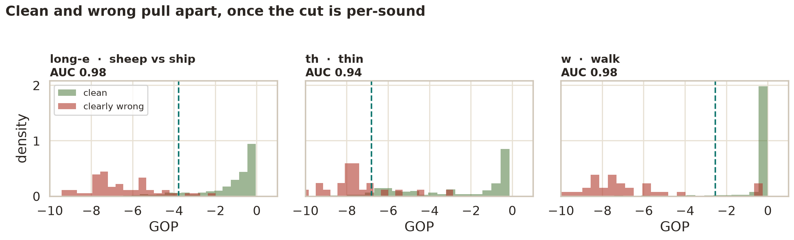
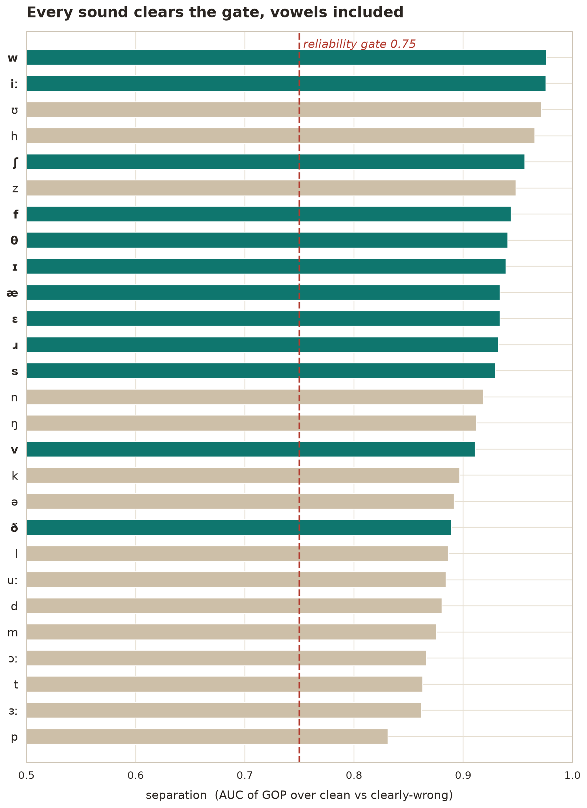

# Teaching a pronunciation model where to draw the line

A pronunciation drill was quietly telling native speakers they were wrong. It would play back a word, listen to you say it, and flag the sound if the model's confidence dropped too low. The idea is sound. The threshold was not: a single hard-coded number, `-5.0`, applied to every sound in English.

The first time it ran on real speech, it failed in both directions at once. It flagged a perfectly native "th" as broken, and it waved a swapped vowel straight through. `sheep` said as `ship`, `walk` said as `wok`, all passing. One number could not tell a good sound from a bad one, and the reason turned out to be worth the whole exercise.

This is how five thousand human-scored recordings turned that guess into a decision rule that actually works, and how it was checked against speech it had never seen.

## The data: five experts, every sound

You cannot learn a threshold without examples of right and wrong. speechocean762 supplies them: 5,000 English clips from non-native speakers, where five human experts scored every individual phoneme from 0 to 2. That per-sound score is ground truth. It is also Apache-2.0 licensed, so it can ship.

The plan was ordinary supervised learning. Run the real acoustic model over the recordings, read off its confidence in each sound, a number called Goodness of Pronunciation or GOP, and pair that confidence with the human score. Given enough pairs, the threshold stops being a guess and becomes a measurement.

We ran the model over 2,500 clips. Transcription was skipped entirely: the words being read are known ahead of time, so only the acoustic model needs to run, which turned an hours-long job into minutes.

## The finding: every sound lives somewhere different

Then we plotted, for each sound, where cleanly-spoken and clearly-wrong renderings actually land.

There is the whole problem in one picture. A native "s" sits near perfect confidence. A native "th" averages `-2.6`, because the model is simply less sure about "th" even when a native speaker nails it. The clean and wrong clouds are real and separable for every sound, but they sit at different places on the axis.

The old `-5.0` line, dashed, cuts through none of it cleanly. It sits so far to the left that a badly-mangled "th" still scores above it and passes, while it clips the low end of confident vowels and false-flags them. A single vertical line was never going to work, because different sounds do not share a baseline.

## The fix: make the threshold personal

So the rule became per-sound. For each phoneme, take the mean and spread of its native confidence, then flag a reading only when it falls more than 1.6 standard deviations below _that sound's own_ mean. The cut travels with the sound.

An earlier quick look had written off the long-e vowel as hopeless, its clean and wrong reads seemingly on top of each other. That was an artifact of comparing clean speech against _borderline_ speech. Set against clearly-wrong reads, long-e separates as cleanly as any consonant, at an AUC of 0.98. The lesson stuck: what you compare against decides what you conclude.

Every one of the 27 sounds separates well enough to earn a verdict.

A reliability gate backs this up. If a sound's confidence ever failed to separate clean from wrong, it would be held out of the verdict rather than guessed at. Today every sound clears it, from 0.83 to 0.98. The gate is insurance for the next model, not a patch for this one.

## Does it generalize, or just memorize?

A rule fit to its own data proves nothing. The real test is speech the fitting never touched. So the thresholds were fit on one half of the corpus and measured on the other half, held out from start to finish.

On that unseen half: it false-flags native speech **7% of the time**, and catches **66% of genuinely-wrong sounds**. That is an honest operating point, and a deliberate one. Nagging a correct speaker erodes trust faster than missing an error, so the cut is tuned to keep false alarms low and accept that a third of subtle errors slip by.

It also fixes the two failures that started this. A native "th" now sits at its own baseline and passes. A substituted vowel drops below its own line and flags. The exact cases that broke the placeholder are the cases the calibration gets right.

## What it does not solve

The flag is trustworthy now. Two things are deliberately left alone. The fluency score is still a crude pause-ratio proxy, waiting on prosody work. And the drill re-showing a pass-or-retry verdict, rather than a raw number, is a small follow-up that builds on this. Calibrating a score you present as truth is the hard part, and that part is done.

## Reproduce it

The whole experiment lives in `scripts/` beside this file: `scripts/measure.py` runs the sweep, `scripts/analyze.py` fits the thresholds, `scripts/validate.py` checks them on held-out speech, and `scripts/plots.py` draws these figures. The models and dataset cache on first download and reuse forever, so a re-run is minutes, not ceremony. See the [README](README.md) for the steps.

Built for Diction, a local, offline pronunciation trainer that keeps every recording on your own machine.
