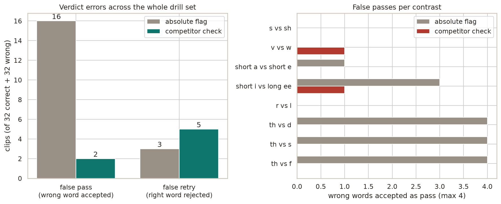

# Minimal-pair verdict evaluation

Whether the production-drill pass-or-retry verdict can tell the target sound of a
contrast from its competitor, measured across the whole curated drill set.

## Why it exists

The drill verdict first shipped reading the absolute per-phoneme flag: retry when
the target phoneme fell below its own native GOP band. That flag was calibrated
on speechocean762 for a different question, "was this an acceptable `θ`", not the
one a minimal-pair drill asks, "was this `θ` rather than `f`". This harness
measures the gap directly and validates the fix.

## Method

For every pair in `drills/minimal_pairs_data.py`, synthesize the correct word and
the competing word with the shipped Piper voice, then score both against the
target. A correct clip should pass, a competing clip should retry. Two verdicts
are compared per clip:

- absolute flag: the target phoneme flags on its own native band, the pre-fix
  behavior
- competitor check: the competing phoneme scores higher than the target at the
  target's own aligned frames, `GopScorer.score_target_contrast`

A false pass, a wrong word accepted, teaches the wrong sound. A false retry, a
right word rejected, only asks the speaker to repeat. False passes are the error
that matters.

Clips are clean synthetic speech, so this is a proxy. It fairly models saying the
other word of the pair, but not a slightly-off target, and Piper's own weak
sounds inflate false retries. Read it as a floor on discrimination, not a
real-speaker accuracy number.

## Findings

Across 32 pairs (64 clips), the competitor check cuts false passes by 8x while
barely moving false retries:

| Error                             | Absolute flag | Competitor check |
| --------------------------------- | ------------- | ---------------- |
| False pass (wrong word accepted)  | 16            | 2                |
| False retry (right word rejected) | 3             | 5                |
| Unscorable (clip too short)       | 7             | 7                |

The absolute flag accepted the wrong word on half of all attempts. The `th`
family (`θ`, `ð`) and short-i were fully broken and are now caught. `r vs l` and
`s vs sh` worked before and still work. The 2 residual false passes are
final-position consonants like `sheath`, where the fricative is mushier than
word-initial. The 7 unscorable clips are short words hitting the duration floor,
a separate robustness gap.



## Re-run

Needs the scoring and tts extras. From `backend/`:

```bash
PYTHONPATH=src uv run python calibration/contrast_eval.py
uv run --with matplotlib --with seaborn python calibration/contrast_plots.py
```

The first writes `contrast_eval.json`, the second reads it and writes
`figures/contrast_verdict.png`.
