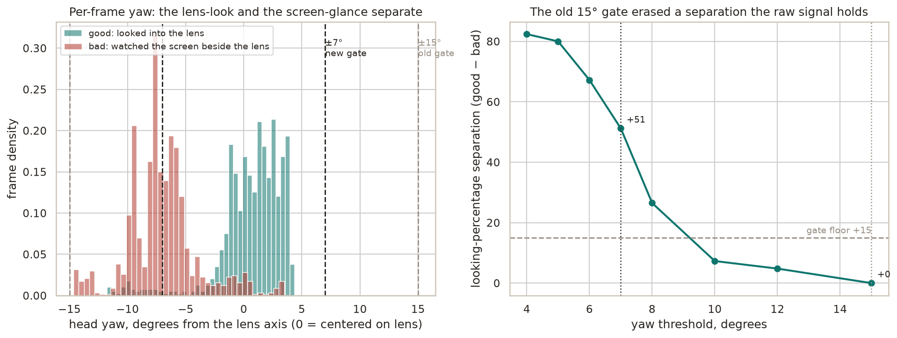

# Interview eye-contact separation

Whether the interview eye-contact metric can tell a take held on the camera lens
from one that drifts to the screen beside it, and why the shipped metric scores
head yaw plus iris but leaves pitch out.

## Why it exists

The interview CV foundation ships a posture and eye-contact scorer, and eye
contact is the signal the two calibration clips were recorded to contrast. An
earlier spike scored gaze against each clip's own opening-two-second baseline,
which read both a lens-look and an off-axis read at 100 percent looking, because
the baseline absorbed whatever direction the take started in. Dropping the
baseline for an absolute forward axis was the first fix. This harness measures
whether that absolute axis actually separates the two takes, and it surfaced a
second problem the first fix alone left standing.

## Method

Run the real MediaPipe FaceLandmarker over `good.mp4` and `bad.mp4`, and for
every frame with a detected face record three numbers: head yaw and pitch from
the facial transformation matrix, and the iris offset within the eye. Yaw is the
horizontal angle away from the lens, pitch the vertical angle, both zero when the
face points straight at the camera. Then sweep the yaw threshold and, at each
step, count the fraction of frames the metric would call looking.

The clips are one speaker, one camera setup, recorded to contrast a good and a
bad delivery of the same answer. This is a separation check on two takes, not a
fit against a labeled corpus. It proves a separation exists and picks a
directional threshold, the same footing as the composite accentedness and prosody
scores, to revalidate as more recordings arrive.

## Findings

The two takes separate cleanly, but on yaw, and the separation is finer than the
first threshold could see.



The good take sits with its head yaw centered near zero, a median of +1.2
degrees, pointed at the lens. The bad take sits about seven degrees to the side,
a median of −7.3 degrees, watching the screen beside the camera rather than the
camera itself. The two yaw distributions barely overlap. But the head never
turned far: both takes keep yaw inside fifteen degrees almost all the time, so
the original fifteen-degree threshold called both takes looking and read a
separation of zero. The signal was there in the raw angle. A loose binary
threshold threw it away.

Tightening the yaw threshold recovers it. At seven degrees the good take reads 96
percent looking and the bad take 45 percent, a 51-point separation, comfortably
past the fifteen-point gate. The threshold sits in the gap between the two
distributions, so it is not knife-edge tuned to either.

| Yaw threshold    | good looking | bad looking | separation |
| ---------------- | ------------ | ----------- | ---------- |
| 15° (pre-fix)    | 100%         | 100%        | +0         |
| 10°              | 98%          | 91%         | +7         |
| 8°               | 97%          | 71%         | +27        |
| **7° (shipped)** | **96%**      | **45%**     | **+51**    |
| 6°               | 96%          | 29%         | +67        |
| 5°               | 96%          | 15%         | +80        |

## Why pitch is excluded

Pitch also separates the two takes, good at a median of +5.8 degrees and bad at
+9.4, the bad take's chin dropping as it read lower. But pitch cannot carry an
absolute forward axis on this setup. The webcam sits above the monitor, so even
the good take, looking straight at the lens, tilts the face up almost six
degrees. A threshold centered on zero pitch would penalize a perfect lens-look
for the camera's mounting, not for the speaker. Yaw has no such offset, because
the lens is horizontally centered, so looking at it means a yaw near zero
regardless of the vertical mounting. The metric leans on yaw and keeps iris as a
cheap secondary gate for eyes cut aside while the head stays forward. Pitch could
return with a calibration frame that measures the speaker's own lens-look pitch,
but that couples the metric to a capture ritual and is deferred.

## Honest limits

This is two clips from one speaker at one camera setup. The seven-degree
threshold is a directional placeholder, not a fitted parameter. A different
camera height, a speaker who sits closer or further, or a genuinely centered
webcam could shift where the lens-look yaw lands, and the threshold would need
rechecking. What the eval establishes is narrower and real: the absolute yaw
axis separates a lens-look from a screen-glance on a subtle seven-degree turn,
and the metric now reads that separation rather than erasing it. Widening the
clip set is the follow-up that turns the placeholder into a calibrated value.

## Re-run

Needs the `interview` extra and the two clips under
`tests/fixtures/interview/video/`, which are gitignored and local to the
real-stack box. From `backend/`:

```bash
uv sync --extra interview
PYTHONPATH=src uv run python calibration/scripts/eye_contact_eval.py
uv run --with matplotlib --with seaborn python calibration/scripts/eye_contact_plots.py
```

The first writes `data/eye_contact_eval.json`, the second reads it and writes
`figures/eye_contact_separation.png`.
